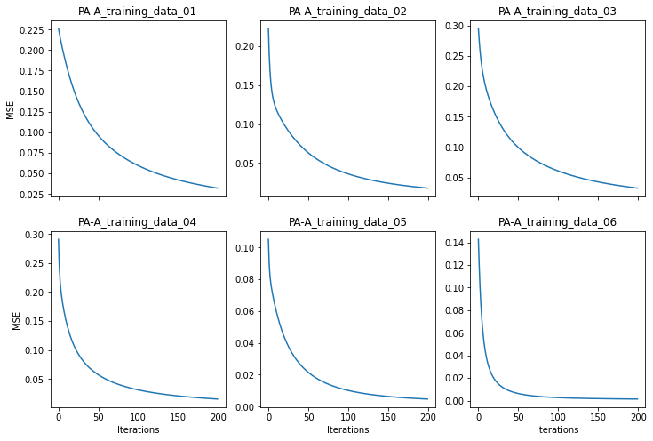
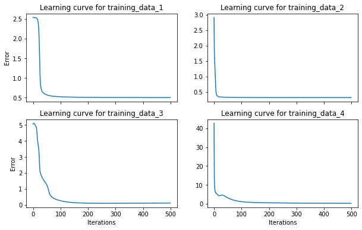

# Train Neural Networks (NN) with Delta rule

This repository contains our teamwork ([Ilaha Manafova](https://www.linkedin.com/in/ilaha-manafova/) & I) projects in the context of *"Technical Neural Networks (TNN)"* course taught by Prof. Goerke at the University of Bonn.

We were supposed to train a:

1. [Perceptron with Delta rule](#perceptron-with-delta-rule)
2. [MLP with Delta rule](#mlp-with-delta-rule)

## Perceptron with Delta rule
We implemented a Perceptron with Delta rule in Python. 

  
   
  Illustration of a Perceptron neuron

The Perceptron was trained with different data, mostly representing boolean operators e.g. `OR` and `AND`, for different times. We used Logistic function as an activation function and MSE as a loss function. The learning rate was set to 0.5 and the number of epochs was set to 500. The following figures show the learning curves for different data:

  
   
  Learning curves for different data

## MLP with Delta rule
We implemented a MLP with Delta rule in Python. For being more straightforward, we implemented the MLP using `dictionary` data structure.

  
   
  Illustration of a MLP network

The MLP was trained with different data. User can choose the number of hidden layers as well as the number of neurons, learning rate, and transfer function in each layer. Following transfer functions are available:

* `Identity function` 
* `Logistic function`
* `Tanh` 
* `ReLU` 
* `LeakyReLU`

At first, all the weights were initialized randomly to be in the range of [-2, 2]. Furthermore, for training the MLP, we feedforward the input data and then backpropagate the error and eventually update the weights using delta rule. For this project, we applied single step learning. The following figures show the learning curves for different data using 1 hidden layer:

  
   
  Learning curves for different data